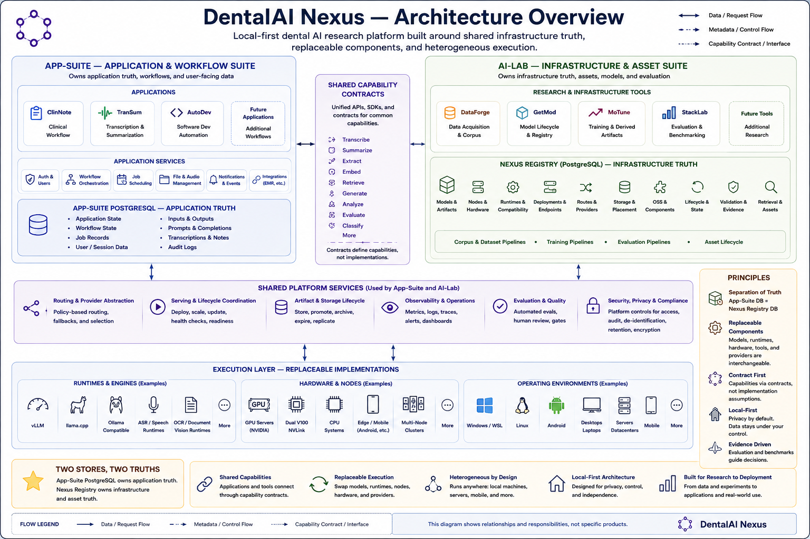
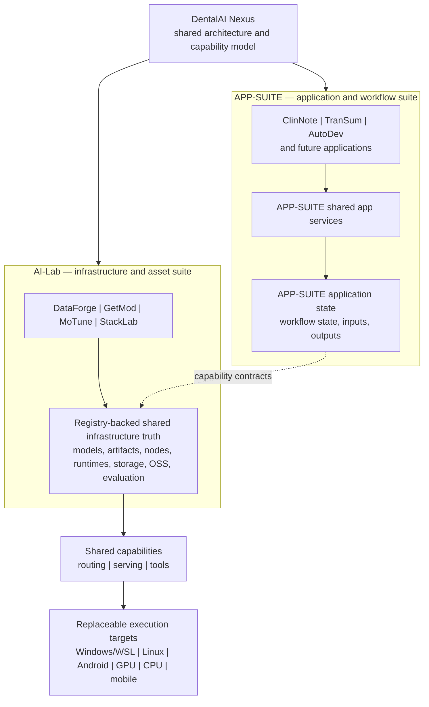

# DentalAI Nexus

> A local-first dental AI research platform built around shared infrastructure truth, replaceable components, and heterogeneous execution.

DentalAI Nexus is a public technical introduction to a private, local-first dental AI research and development system. It documents a personal research project being built by a practicing dentist. It is not the private source repository, a commercial product, a clinical decision system, or a claim that the system is ready for production deployment.

The project grew from a practical question: what can modern AI do when it is designed around the needs, constraints, and workflows of an actual dental practice? The answer is developing into a broader local AI platform covering speech, language models, retrieval, multimodal document processing, agent orchestration, evaluation, and deployment across very different hardware.

This is not a single dental chatbot. Multiple applications and research tools consume shared capabilities built around a Registry-backed source of shared infrastructure truth for models, artifacts, nodes, runtimes, storage, routing, evaluation, and heterogeneous execution. The individual technologies are intentionally replaceable; the durable architecture is the metadata, capability, lifecycle, and interface boundaries connecting them.

The implementation is currently private while it remains under active development. This public repository is a curated project overview: it explains the architecture, research direction, evidence that can be shared, and the kinds of collaboration that may become useful. Suitable software, evaluations, integrations, and research artifacts may be released as they mature.



## Why this project exists

The goal is not simply to run a chatbot or to own a collection of GPUs. The differentiating combination is:

```text
practicing dentist
      + real dental-office workflow knowledge
      + independently developed AI platform
      + dental knowledge and corpus infrastructure
      + local/private-first deployment
      + heterogeneous compute for comparative testing
      + measurement, integration, and evaluation
```

I am an independent builder and practicing dentist, not a professional software engineer or academic ML researcher. The technical depth of the project is best judged from its architecture, implementation history, live integrations, benchmarks, and evaluation discipline—not from a title.

This is a personal research and development project, funded and independently developed for local research, experimentation, and practical deployment. It is not a startup or a commercial product being developed for sale. The work has been strongly enabled by open-source software, and the long-term intention is to contribute useful evaluations, integrations, research observations, and—where appropriate—software components back to the open-source community.

## System at a glance

DentalAI Nexus is the public umbrella for two peer private suites:

- **APP-SUITE — application and workflow suite:** clinical, transcription, automation, and future application workflows, with application-specific state and services.
- **AI-Lab — AI infrastructure, asset, model, corpus, training, and evaluation suite:** acquisition, corpus and dataset work, model/artifact lifecycle, training, benchmarking, and Registry-backed infrastructure truth.

They are separate code repositories with shared architectural boundaries. Runtime data, model weights, databases, caches, and operational artifacts are deliberately kept outside the code repositories.



The architecture is intentionally layered:

- Applications own user-facing workflows and application data.
- Orchestrators decompose tasks, delegate work, and call approved tools and capabilities.
- A PostgreSQL-backed Registry/control plane tracks shared infrastructure facts such as models, artifacts, storage placement, nodes, runtime compatibility, endpoint lifecycle, route policy, OSS relationships, and validation metadata.
- A routing layer can expose OpenAI-compatible local endpoints and provider abstraction without becoming the source of model truth.
- Execution runtimes—such as llama.cpp, vLLM, Ollama where appropriate, and specialized local runtimes—run approved artifacts.

Registry is the center of shared infrastructure truth, not necessarily the synchronous path for every inference request. An application may send traffic through a router directly to a runtime while Registry supplies the authoritative relationships and eligibility facts behind that path. See [the expanded architecture overview](docs/architecture.md).

The key boundary is **separate truths, shared contracts**: APP-SUITE owns application and workflow state; AI-Lab owns infrastructure, asset, corpus, training, and evaluation capabilities; Registry provides shared infrastructure truth across both suites.

## The application ecosystem

The shared platform exists to support multiple useful consumers rather than one monolithic dental assistant:

| Area | Public role |
| --- | --- |
| ClinNote | Private clinical workflow application for capture, transcription, relevance/embedding stages, compilation, summarization, and final note generation |
| TranSum | Separate non-clinical transcription and summarization application with diarization and ASR workflows |
| AutoDev | Controlled autonomous software-development workflow and integration automation |
| DataForge | Acquisition, document processing, corpus construction, provenance, and dataset generation |
| GetMod | Model discovery, acquisition, artifact identity, cataloging, and storage metadata |
| MoTune | Training, fine-tuning, distillation, adapter management, and derived artifacts |
| StackLab | Model/runtime evaluation, benchmarking, validation, and regression evidence |

These are private application and research boundaries, not public commercial products. Their presence demonstrates why shared model, artifact, storage, routing, and evaluation infrastructure is useful.

See [the architecture overview](docs/architecture.md) for the public-safe version of this model.

## Research areas

### Local LLM and model serving

The system favors local open-weight models selected for the task and hardware rather than assuming that one enormous model is the answer to every problem. Model artifacts are kept outside source repositories and are managed separately from application code.

The serving layer has exercised or integrated runtimes including llama.cpp-derived execution, vLLM, and model-specific or mobile execution paths. A registry/control-plane approach is used to keep model identity, artifact format, compatibility, placement, validation, and endpoint lifecycle separate from runtime-private caches.

### Dental RAG and knowledge retrieval

The dental knowledge pipeline collects and processes approved sources, preserves provenance and rights metadata, creates immutable corpus versions, and derives chunks, facts, embeddings, and datasets as linked projections. Retrieval is intended to ground local models in domain knowledge and to make evidence and source lineage inspectable.

The corpus includes a growing mixture of public and permission-constrained material. The public repository will never publish the corpus, private datasets, retrieved passages, copyrighted source text, or patient-derived content. Corpus size and release status will be reported only when doing so is accurate and safe.

### Speech and ASR

The speech pipeline is a staged system rather than a single transcription call. It includes audio ingest, normalization and segmentation, voice-activity handling, model-specific transcription, optional embedding/relevance stages, downstream synthesis, and evaluation.

ASR experiments span desktop/server GPU execution, CPU-compatible paths, and Qualcomm mobile acceleration through Android/QNN. Publicly shareable results are limited to aggregate compatibility and timing observations; audio, transcripts, references, and clinical content remain private.

### Multimodal processing

The platform includes document extraction, OCR, layout analysis, tables, scanned documents, image-aware processing, and selected vision-capable model paths. This is multimodal infrastructure for documents and workflows; it is not a public claim of a validated dental radiology or diagnostic model.

### Agents and orchestration

The intended orchestration boundary is separate from application and infrastructure authority. An agent layer can decompose tasks, select among approved capabilities, call safe tools, and coordinate workflows. It should not own canonical model identity, storage placement, corpus provenance, production clinical state, or policy authority.

Open-source orchestration systems such as OpenJarvis are being evaluated as consumers of approved models, endpoints, tools, and capabilities rather than replacements for the control plane. MCP-style tool boundaries are a direction for exposing narrow, observable, non-PHI operations.

Open-source components are integrated as implementations, not adopted as architectural authorities. A runtime, orchestrator, parser, vector system, UI, or observability tool may provide a valuable capability without becoming the canonical owner of model identity, node state, storage placement, application data, or platform policy.

### Evaluation and benchmarking

Evaluation is a first-class part of the system. The infrastructure supports held-out gold sets, deterministic output checks, citation overlap, missing-output detection, unsupported-citation detection, model/runtime compatibility tests, latency and throughput measurements, regression comparisons, and hardware/runtime matrices.

Not every experiment is a clinical-quality study. Public reports will label whether a result is a smoke test, compatibility observation, throughput benchmark, cache/offload correctness test, preliminary comparison, or quality evaluation. The same validated dual-V100 serving setup has been measured across long-context host-RAM prefix restoration and short HTTP concurrency/endurance workloads; both are summarized with their limitations in [the evaluation notes](docs/evaluation.md). No result will be presented as a clinical validation study unless that study has actually been performed.

### Dental corpus and knowledge infrastructure

The corpus architecture separates:

```text
approved source
  -> immutable source version and provenance
  -> text/layout/audio/image derivatives
  -> versioned corpus and chunks
  -> evidence-linked facts and embeddings
  -> reviewed dataset recipes and dataset versions
  -> training, retrieval, and evaluation
```

This design supports source-level split assignment, provenance, review state, rights metadata, reproducibility, and the ability to keep restricted content inside the private environment.

## Heterogeneous compute environment

The system is intentionally spread across different deployment targets:

- Windows with WSL2 for the primary desktop/workstation environment and Linux-compatible services.
- Native Linux hardware for server-style inference and higher-memory workloads.
- Desktops and laptops for development, local inference, and operator workflows.
- Repurposed datacenter hardware for larger-memory or multi-GPU experiments.
- Android/mobile hardware for edge ASR and Qualcomm GPU/NPU acceleration through QNN.
- NVIDIA Blackwell-class GPUs in the Windows/WSL desktop environment.
- NVIDIA V100 datacenter GPUs connected with NVLink for high-VRAM or model-parallel experiments.
- CPU inference for compatible OCR, document, embedding, and fallback workloads.
- Qualcomm mobile GPU/NPU acceleration for constrained, low-power ASR experiments.

The value of this environment is comparative testing. A dental AI component that works on one workstation may behave very differently on native Linux, a V100/NVLink node, a CPU-only path, or a mobile accelerator. Testing across these environments exposes memory limits, initialization costs, input-shape assumptions, runtime portability issues, latency tradeoffs, and deployment constraints that a single-GPU benchmark would miss. A small synthetic dual-V100 runtime, scaling, and short endurance benchmark is now summarized in [the evaluation notes](docs/evaluation.md); it is not a model-quality result. The architecture document contains the corresponding deployment diagram.

Hardware supports the research story; it is not the story by itself. The important question is whether the same dental AI component can be measured, adapted, and evaluated across realistic deployment targets.

## What I can contribute to collaborations

Depending on the project and access requirements, I may be able to contribute:

- Practicing-dentist domain expertise.
- Knowledge of real dental-office workflows and the difference between plausible language and clinically sensible behavior.
- Clinical review of model outputs and failure modes, subject to appropriate safeguards.
- Model and inference benchmarking across local hardware and runtimes.
- RAG and retrieval evaluation, including grounding and citation behavior.
- Heterogeneous hardware testing across desktop, server, CPU, and mobile targets.
- Agent, tool-boundary, and end-to-end integration testing.
- A substantial and growing dental knowledge corpus and related infrastructure, subject to licensing, privacy, provenance, and data-use restrictions.

I am especially interested in collaborations where domain expertise and practical evaluation are useful—not in acquiring restricted research assets for commercialization.

## Current status and limitations

This is an active working system. Some components are live-proven, some are implemented but still evolving, and some remain architectural direction or experimental work. The public repository will preserve those distinctions.

The system is not presented as:

- a medical device;
- a substitute for professional judgment;
- a validated clinical decision-support product;
- a commercial offering;
- a public release of the private implementation;
- evidence that every described capability is production-ready.

## Public boundary

The public repository will contain curated explanations, safe diagrams, selected aggregate benchmark summaries, and links to public upstream projects. It will not contain source code copied from the private repositories, private infrastructure instructions, credentials, network details, patient information, private datasets, corpus contents, or proprietary third-party material.

See [the publication boundary](docs/public-boundary.md) and [evaluation notes](docs/evaluation.md).

## Collaboration

If you are working on dental AI, medical language technology, ASR, RAG, local inference, evaluation, or heterogeneous deployment, an introductory discussion is welcome. Please treat this repository as a technical overview of an evolving private project, not as an API or release commitment.
