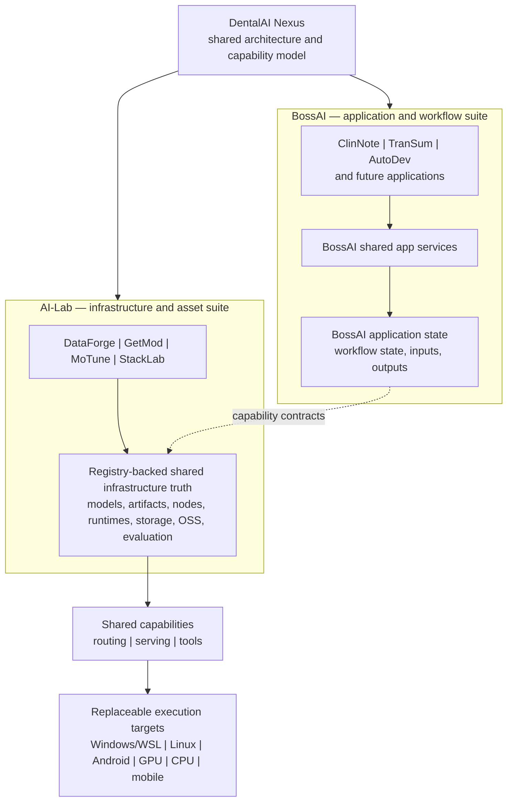
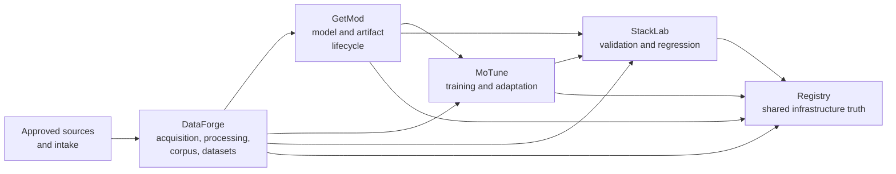
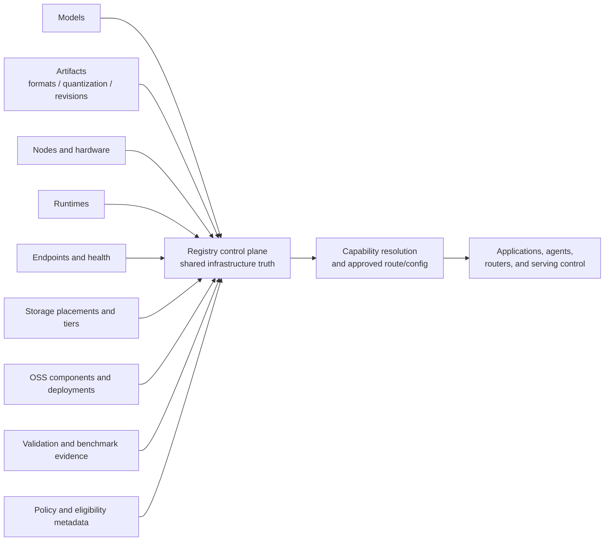
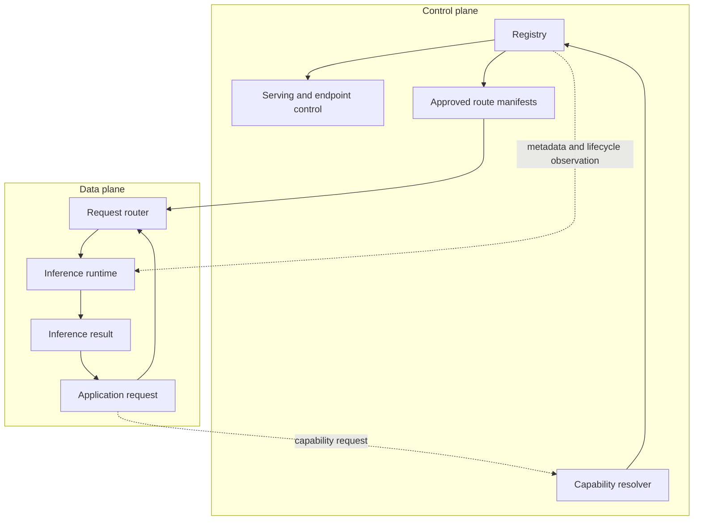
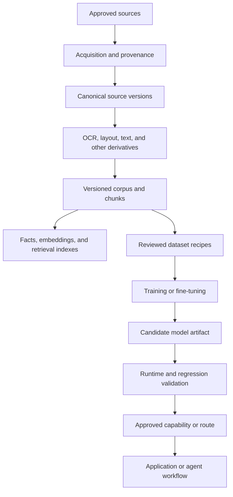
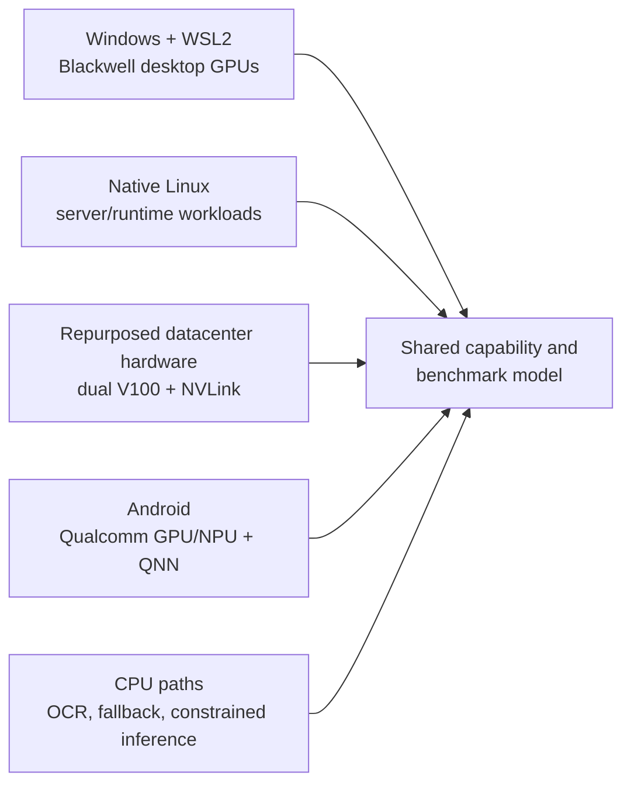

# DentalAI Nexus — public architecture overview

This document describes the architecture at a capability and ownership level. It intentionally omits hostnames, addresses, ports, mount paths, credentials, deployment commands, private schemas, and private implementation details.

The implementation is private and active. The labels below distinguish architectural direction from selected paths that have been implemented or live-proven.

## The central architectural idea

This is not a single dental chatbot. It is a private, local-first AI platform in which multiple applications and research tools consume shared capabilities built around a Registry-backed source of shared infrastructure truth for models, artifacts, nodes, runtimes, storage, routing, evaluation, and heterogeneous execution.

The individual technologies are intentionally replaceable. The durable architecture is the metadata, capability, lifecycle, and interface boundaries connecting them.

The system is designed so that infrastructure implementations can be replaced behind capability, metadata, and interface boundaries. This has been exercised in selected runtime, routing, Registry, and hardware paths; it is not a claim that every substitution is currently automatic.

The platform is intentionally designed to remain agnostic across models, runtimes, storage backends, orchestration frameworks, hardware targets, operating environments, and application consumers. Applications consume capability contracts rather than binding themselves to a specific model, endpoint, machine, operating system, or OSS component. Models, runtimes, nodes, accelerators, routes, and related infrastructure are registered as eligible implementations behind shared metadata and lifecycle boundaries so that technologies can evolve without requiring the surrounding system to be redesigned.

## Architectural principles

### Separation

Code, application data, model artifacts, runtime state, caches, and generated outputs are managed as different classes of resources. Large artifacts and operational data remain outside Git.

### Shared truth

Applications should not independently maintain conflicting descriptions of models, artifacts, storage placement, hardware, runtime compatibility, or endpoint state. Those are shared infrastructure facts.

### Capability abstraction

An application or research tool should describe the work it needs performed—such as transcription, document extraction, embedding, summarization, or multimodal processing—rather than hard-coding a particular model, filesystem location, machine, GPU, runtime, or route alias.

### Replaceability

No infrastructure component should become the architecture. Models, runtimes, storage systems, parsers, embedding engines, vector-search systems, orchestration frameworks, and hardware targets are implementations behind more durable boundaries.

### Local-first experimentation

The system favors local and privately controlled execution where practical, while retaining interfaces that allow controlled comparison with other providers or deployment targets when useful.

## Two peer suites under DentalAI Nexus

DentalAI Nexus is the public umbrella for two peer private suites:

- **BossAI — application and workflow suite:** clinical, transcription, automation, and future application workflows, with application-specific state and services.
- **AI-Lab — AI infrastructure, asset, model, corpus, training, and evaluation suite:** acquisition, corpus and dataset work, model/artifact lifecycle, training, benchmarking, and Registry-backed infrastructure truth.

They are separate repositories with shared architectural boundaries. The important distinction is ownership: BossAI owns application truth, while AI-Lab owns infrastructure and asset capabilities. Registry provides shared infrastructure truth across both suites.

BossAI applications remain owners of their own workflows and application-specific state. AI-Lab applications remain owners of their research and asset workflows. Both suites are intended to be independently replaceable consumers: an application can be added, replaced, or retired without making it the owner of shared model, runtime, storage, or platform truth. Shared infrastructure exists so that each suite does not need to recreate model catalogs, runtime selection, storage placement, serving lifecycle, observability, or evaluation mechanisms.

### Separate truths, shared contracts

The database distinction is deliberate:

- **BossAI application state:** workflow state, application inputs and outputs, job records, and application-specific metadata.
- **Registry/control-plane state:** models, artifacts, nodes, hardware, runtimes, compatibility, endpoints, routes, storage placement, lifecycle, OSS relationships, and validation/evaluation metadata.

Registry is not a universal database. It does not own prompts, completions, audio, transcripts, clinical notes, patient identifiers, or application content. The two suites connect through capability and metadata contracts rather than sharing ownership of the same data.

## Agnosticism across the platform

| Dimension | Intended boundary |
| --- | --- |
| Models | Replaceable behind capability, artifact, and validation boundaries |
| Runtimes | Replaceable behind routing and compatibility boundaries |
| Hardware | Replaceable behind node, capability, and benchmark boundaries |
| Operating systems | Portable across Windows/WSL, native Linux, and Android execution environments where the capability supports it |
| Nodes | Resolved as eligible distributed execution targets rather than hard-coded hosts |
| Applications | Independent consumers of shared platform capabilities and infrastructure contracts |
| OSS components | Useful implementations, not architectural authorities |

This is an architectural design objective supported by selected live integrations and benchmark paths, not a claim that every boundary is already fully portable or automatically swappable.

## Application and asset ecosystem

| Component | Public role | Maturity description |
| --- | --- | --- |
| ClinNote | Private clinical workflow application covering capture, audio persistence, transcription, relevance/embedding stages, compilation, summarization, and final note generation | Implemented and actively developed; clinical data and workflows remain private |
| TranSum | Separate non-clinical transcription and summarization application with normalization, optional denoising, diarization, ASR, and on-demand summaries | Implemented and actively developed |
| AutoDev | Controlled autonomous software-development workflow involving mission packets, remote execution, review artifacts, and pull-request integration | Implemented internal automation; operational details remain private |
| DataForge | Acquisition, document processing, corpus construction, provenance, dataset generation, quality review, and export | Implemented and actively expanding |
| GetMod | Model discovery, recommendation, acquisition, cataloging, artifact identity, storage metadata, and placement | Implemented and actively expanding |
| MoTune | Training, fine-tuning, distillation, adapter management, lineage, and derived model artifacts | Implemented with active development; not all workflows are production-ready |
| StackLab | Runtime/model testing, benchmark collection, validation, regression comparison, and hardware/runtime evaluation | Implemented and actively used |

These are not presented as independent commercial products. They are application and infrastructure/asset boundaries within a larger private system.

## AI-Lab as an infrastructure and asset suite

AI-Lab is more than a directory of experiments. It is an infrastructure and asset suite whose major boundaries are intentionally separated:

At a high level:

- DataForge preserves acquisition provenance, source versions, document derivatives, corpus versions, dataset recipes, review state, and export lineage.
- GetMod treats models as shared suite assets rather than as files owned by one application role. It tracks model/artifact identity, acquisition, classification, placement, and compatibility metadata.
- MoTune turns reviewed training inputs into controlled training or adaptation runs and derived artifacts with lineage and provenance.
- StackLab measures candidates and runtimes, records validation and regression evidence, and provides comparison data without automatically declaring a universal winner.

Additional research work includes speech/ASR evaluation, multimodal document processing, open-source integration, deployment experiments, and runtime benchmarking where supported by the current implementation.

## Registry as shared infrastructure truth

Registry is not merely “a PostgreSQL database.” It is the control-plane boundary for shared infrastructure facts.

Registry records or is designed to coordinate facts about:

- models and immutable artifacts;
- formats, quantizations, revisions, checksums, and verification;
- storage placements and hot/warm/cold lifecycle state;
- nodes, hardware, accelerators, capacity, and freshness;
- runtimes and model/runtime compatibility;
- deployments, endpoints, health, and heartbeat state;
- routes, aliases, approvals, and provider metadata;
- validation, benchmark, and qualification evidence;
- policy and eligibility metadata;
- OSS projects, installations, deployments, and endpoint relationships;
- datasets, embeddings, retrieval assets, and memory infrastructure metadata where appropriate.

The conceptual relationship is:

The application should not need to know that a model lives on a particular machine, at a particular path, behind a particular runtime, or under a particular route alias. It requests a capability or consumes an approved capability contract. Registry and related control-plane services determine which implementations are currently eligible.

Registry does not execute inference and does not own application content. It must not contain patient identifiers, clinical notes, transcripts, audio, prompts, completions, retrieved source text, or private corpus contents.

## Control plane versus data plane

Registry is the center of shared truth, not necessarily the synchronous path for every request.

For example, inference traffic may flow directly from an application through a router to a runtime. Registry supplies the relationship, eligibility, and lifecycle facts used to configure or select that path; it does not need to receive the prompt or completion.

## Replaceable implementations and OSS philosophy

Open-source components are integrated as implementations, not adopted as architectural authorities. A runtime such as vLLM, an orchestrator such as OpenJarvis, a parser, vector system, UI, or observability tool may provide a valuable capability without becoming the canonical owner of model identity, node state, storage placement, application data, or platform policy.

Examples of replaceable or evaluated implementation categories include:

- vLLM, llama.cpp, and Ollama-compatible serving paths;
- ASR and speech runtimes, including CPU and mobile-specific implementations;
- OCR, layout, parsing, and multimodal document systems;
- embedding models and vector-search implementations;
- LiteLLM or another compatible routing layer;
- OpenJarvis or another orchestration framework;
- MCP/A2A-style interoperability boundaries;
- Blackwell, V100/NVLink, CPU, and Qualcomm mobile execution targets.

OpenJarvis is being evaluated as a downstream consumer of approved capabilities. It is not the source of Registry truth, application data, storage policy, or clinical workflow authority.

## Model, knowledge, and artifact lifecycle

The dental corpus and knowledge infrastructure are private. The public architecture can describe provenance, versioning, retrieval, evaluation, licensing, and data-use controls, but it does not publish corpus text, private datasets, retrieved passages, patient-derived content, or copyrighted/licensed source material.

Training outputs do not automatically become runtime defaults. Candidate artifacts pass through verification, compatibility, evaluation, and promotion boundaries.

## Heterogeneous execution environment

The system deliberately spans Windows/WSL, native Linux, desktops, laptops, repurposed datacenter hardware, Android devices, NVIDIA Blackwell GPUs, dual NVIDIA V100 GPUs connected with NVLink, CPU inference, and Qualcomm mobile GPU/NPU acceleration.

The purpose is not hardware collection. It is comparative deployment research. The same dental AI component can encounter different memory limits, initialization costs, context behavior, runtime support, input-shape assumptions, latency characteristics, and power/portability constraints on each target.

This environment makes it possible to test whether a component is merely fast on one workstation or genuinely portable across realistic inference targets.

## Maturity and limitations

Some components are live-proven, some are implemented but evolving, and some remain architectural direction or experimental work. Public claims should preserve those distinctions.

The architecture is not a claim that:

- every component is production-ready;
- every implementation can already be swapped automatically;
- the system is a medical device or validated clinical decision-support product;
- OpenJarvis or another orchestrator owns the platform;
- Registry autonomously schedules the entire environment;
- the corpus or datasets are publicly distributable;
- private clinical workflows or data are exposed.

## Public boundary

This document intentionally excludes PHI, hostnames, IP addresses, ports, network topology, filesystem paths, credentials, deployment procedures, private source code, private schemas, corpus contents, licensed material, and office security configuration.
